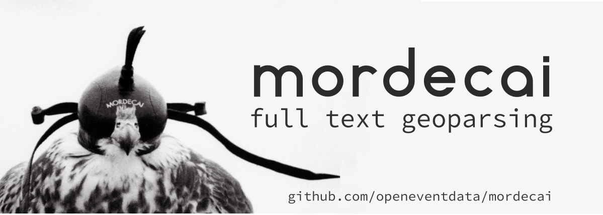

Full text geoparsing as a Python library. Extract the place names from a piece of
text, resolve them to the correct place, and return their coordinates and
structured geographic information.

Why Mordecai?
------------

Mordecai was developed to address several specific needs that previous text
geoparsing software did not. These specific requirements include:

- Overcoming a strong preference for US locations in existing geoparsing
  software. Mordecai makes determining the country focus of the text should
  be a separate and accurate step in the geoparsing process.
- Ease of setup and use. The system should be installable and usable by people
  with only basic programming skills. Mordecai does this by running as a Python 
  library.
- Drop-in replacement for [CLIFF](http://cliff.mediameter.org/)/
[CLAVIN](https://clavin.bericotechnologies.com/) in the [Open Event Data
Alliance](https://github.com/openeventdata) event data pipeline.
- Ease of modification. This software was developed to be used primarily by
  social science researchers, who tend to be much more familiar with Python
  than Java. Mordecai makes the key steps in the geoparsing process (named entity
  extraction, place name resolution, gazetteer lookup) exposed and easily
  changed.
- Language-agnostic architecture. The only language-specific components of
  Mordecai are the named entity extraction model and the word2vec model. Both
  of these can be easily swapped out, giving researchers the ability to
  geoparse non-English text, which is a capability that has not existed in open
  source software until now.

How does it work?
-----------------

`Mordecai` accepts text and returns structured geographic information extracted
from it. It does this in several ways:

- It uses [spaCy](https://github.com/explosion/spaCy/)'s named entity recognition to
  extract placenames from the text.

- It uses a country-filtered search of the [geonames](http://www.geonames.org/)
  gazetteer in [Elasticsearch](https://www.elastic.co/products/elasticsearch)
  (with some custom logic) to find the latitude and longitude for each place
  mentioned in the text.

- It uses neural networks implemented in [Keras](https://keras.io/) and trained on new annotated
    placenames to infer the correct country and gazetteer entries for each
    placename. 

Example usage
-------------

```
> from mordecai import Geoparse
> geo = Geoparse()
> geo.geoparse("I traveled from Oxford to Lima.")

[{'country_conf': 0.96474487,
  'country_predicted': 'GBR',
  'geo': {'admin1': 'to do',
   'country_code3': 'GBR',
   'feature_class': 'P',
   'feature_code': 'PPLA2',
   'geonameid': '2640729',
   'lat': '51.75222',
   'lon': '-1.25596',
   'place_name': 'Oxford'},
  'spans': [{'end': 22, 'start': 16}],
  'word': 'Oxford'},
 {'country_conf': 0.99259007,
  'country_predicted': 'PER',
  'geo': {'admin1': 'to do',
   'country_code3': 'PER',
   'feature_class': 'P',
   'feature_code': 'PPLC',
   'geonameid': '3936456',
   'lat': '-12.04318',
   'lon': '-77.02824',
   'place_name': 'Lima'},
  'spans': [{'end': 30, 'start': 26}],
  'word': 'Lima'}]
```


Tests
-----

`mordecai` includes a few unit tests. To run the tests:

```
cd resources
py.test
```

The tests require access to a running Elastic/Geonames service to
complete. 

The current CI build status is: [](https://circleci.com/gh/openeventdata/mordecai)

Acknowledgements
----------------

An earlier verion of this software was donated to the Open Event Data Alliance
by Caerus Associates.  See [Releases](https://github.com/openeventdata/mordecai/releases) for the
2015-2016 and the 2016-2017 production versions of Mordecai.

This work was funded in part by DARPA's XDATA program, the U.S. Army Research
Laboratory and the U.S. Army Research Office through the Minerva Initiative
under grant number W911NF-13-0332, and the National Science Foundation under
award number SBE-SMA-1539302. Any opinions, findings, and conclusions or
recommendations expressed in this material are those of the authors and do not
necessarily reflect the views of DARPA, ARO, Minerva, NSF, or the U.S.
government.

Citing
------

If you use this software in academic work, please cite as 

Halterman, (2017). Mordecai: Full Text Geoparsing and Event Geocoding. *Journal of Open Source
Software*, 2(9), 91, doi:10.21105/joss.00091

```
@article{halterman2017mordecai,
  title={Mordecai: Full Text Geoparsing and Event Geocoding},
  author={Halterman, Andrew},
  journal={The Journal of Open Source Software},
  volume={2},
  number={9},
  year={2017},
  doi={10.21105/joss.00091}
}
```

Contributing
------------

Contributions via pull requests are welcome. Please make sure that changes
pass the unit tests. Any bugs and problems can be reported
on the repo's [issues page](https://github.com/openeventdata/mordecai/issues).

